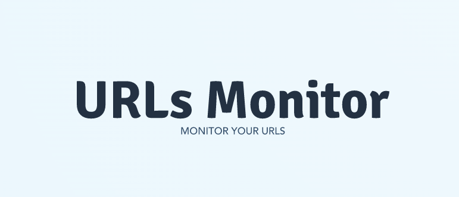

<div id="top"></div>

[![Contributors][contributors-shield]][contributors-url]
[![Forks][forks-shield]][forks-url]
[![Stargazers][stars-shield]][stars-url]
[![Issues][issues-shield]][issues-url]
[![MIT License][license-shield]][license-url]
[![LinkedIn][linkedin-shield]][linkedin-url]


<!-- PROJECT LOGO -->
<br />
<div align="center">
  <a href="https://github.com/bellottoeric/urls-monitor">
    
  </a>

  <h3 align="center">URLs Monitor</h3>

  <p align="center">
    Monitor your URLs and get alerted on Discord and Mail
    <br />
    <a href="https://github.com/bellottoeric/urls-monitor#user-content-top"><strong>Explore the docs »</strong></a>
    <br />
    <br />
    <a href="https://github.com/bellottoeric/urls-monitor#user-content-about-the-project">View Demo</a>
    ·
    <a href="https://github.com/bellottoeric/urls-monitor/issues">Report Bug</a>
    ·
    <a href="https://github.com/bellottoeric/urls-monitor/issues">Request Feature</a>
  </p>
</div>


<!-- TABLE OF CONTENTS -->
<details>
  <summary>Table of Contents</summary>
  <ol>
    <li>
      <a href="#about-the-project">About The Project</a>
      <ul>
        <li><a href="#built-with">Built With</a></li>
      </ul>
    </li>
    <li>
      <a href="#getting-started">Getting Started</a>
      <ul>
        <li><a href="#prerequisites">Prerequisites</a></li>
        <li><a href="#installation">Installation</a></li>
      </ul>
    </li>
    <li><a href="#usage">Usage</a></li>
    <li><a href="#roadmap">Roadmap</a></li>
    <li><a href="#contributing">Contributing</a></li>
    <li><a href="#license">License</a></li>
    <li><a href="#contact">Contact</a></li>
    <li><a href="#acknowledgments">Acknowledgments</a></li>
  </ol>
</details>


<!-- ABOUT THE PROJECT -->
## About The Project

[![Product Name Screen Shot][product-screenshot]](https://github.com/bellottoeric/urls-monitor)

URLs Monitor is a NodeJS script that monitors URLs from a configuration file.
The script uses the axios library to make the query and you can customize the headers for your use.
You can use it to monitor websites and APIs, all of which have http/https addresses.
When an error occurs, an alert is sent to Discord and/or an email address. 
You must specify all configuration requirements in the config.js file.

<p align="right">(<a href="#top">back to top</a>)</p>


### Built With

The whole project was coded with NodeJS 16.16.0 and NPM 8.11.0.
All major libraries are listed below:

* [![Node][Node.js]][Node-url]
* [![Axios][Axios]][Axios-url]
* [![Discord][Discord.js]][Discord-url]
* [![Nodemailer][Nodemailer]][Nodemailer-url]

<p align="right">(<a href="#top">back to top</a>)</p>


<!-- GETTING STARTED -->
## Getting Started

By following the prerequisites step and the installation step, you will have a working local copy.

### Prerequisites

First things first

* NodeJS LTS is needed for running the project.

Download NodeJS
https://nodejs.org/en/
  

### Installation


0. Clone the repo && cd && npm i && echo success message
   ```sh
   git clone https://github.com/bellottoeric/urls-monitor.git && cd urls-monitor && npm install && echo -e '\n\n\n\033[32mSuccessful download! Edit config.js, Create and Edit .env, Edit your URLs list then npm start !\033[0m\n\n\n'
   ```

1. Clone the repo
   ```sh
   git clone https://github.com/bellottoeric/urls-monitor.git
   ```

2. Install NPM packages
   ```sh
   npm install
   ```

3. Enter your settings in `config.js`

4. Create `.env` at the beginning of the project 

5. Edit `.env` Enter your Gmail and Discord credentials
   ```sh
   discordBotToken="azDnwTzg4NTUwPu34vTg7MEc1.Y1lvVG.mfkSSQ42S0vijTDoTuxgkZCFcZq"
   gmailUsername="mygmailaddresse@gmail.com"
   gmailPassword="myapplicationpassword"
   ``` 


<p align="right">(<a href="#top">back to top</a>)</p>


<!-- USAGE EXAMPLES -->
## Usage

### Create Discord Token
  
https://www.writebots.com/discord-bot-token/

<strong>You have to invite the robot on the same server as the targeted users and targeted channels.</strong>


### Create Gmail Password Application
  
https://support.google.com/mail/answer/185833?hl=en


### Configuration of the URLS

The content of the path URLs file have to be an array of objects containing:

* axiosConfiguration : (ARRAY OF OBJECT) : It is the object passed to the request function. It needs to be a correct Axios configuration object.

* expectedResponseStatusCode : (NUMBER) : It is the status code you are expected from the request. If it is not the same, an alert is triggered.

* alert : (ARRAY) : It must contain "mail" and/or "discord"

```json
  [
    ...
   {
        "axiosConfiguration": {
            "baseURL": "https://api.ipify.org?format=json",
            "method": "get",
            "timeout": 1000
        },
        "expectedResponseStatusCode": 200,
        "alert": [
            "mail",
            "discord"
        ]
    },
    ...
  ]
   ``` 

You can checkout the default configuration at https://github.com/bellottoeric/urls-monitor/blob/master/sampleList.txt


### Execution of the script
```sh
   npm start
   ``` 
The script will start from `index.js` and call the verification process. <br />
The verification process is in `src/verification.js` and it is called every session of monitoring full URLs. <br />
Then the query is made from `src/request.js` and return an error if the status code isn't the same as expected. <br />
For all the errors caught, the linked alert will be triggered. `src/alert/` <br />


<p align="right">(<a href="#top">back to top</a>)</p>


<!-- ROADMAP -->
## Roadmap

- [x] Add Discord alerts
- [x] Add Mail alerts
- [ ] Add a better logs system
- [ ] Add unit test
- [ ] Add delay beetwin alerts
- [ ] When an URLs trigger an alert, check the URL after some time and alert when the URL get back with the expected status code.
 
See the [open issues](https://github.com/bellottoeric/urls-monitor/issues) for a full list of proposed features (and known issues).

<p align="right">(<a href="#top">back to top</a>)</p>


<!-- CONTRIBUTING -->
## Contributing

Any contributions you make are **greatly appreciated**.

If you have a suggestion that would make this better, please fork the repo and create a pull request. <br />
You can also simply open an issue with the tag "enhancement". <br />
Don't forget to give the project a star! Thanks again! <br />

1. Fork the Project
2. Create your Feature Branch (`git checkout -b feature/AmazingFeature`)
3. Commit your Changes (`git commit -m 'Add some AmazingFeature'`)
4. Push to the Branch (`git push origin feature/AmazingFeature`)
5. Open a Pull Request

<p align="right">(<a href="#top">back to top</a>)</p>


<!-- LICENSE -->
## License

Distributed under the MIT License. See `LICENSE.txt` for more information.

<p align="right">(<a href="#top">back to top</a>)</p>


<!-- CONTACT -->
## Contact

Bellotto Eric - [Linkedin Bellotto Eric](https://www.linkedin.com/in/eric-bellotto/) - bellottoeric@gmail.com

Project Link: [https://github.com/bellottoeric/urls-monitor](https://github.com/bellottoeric/urls-monitor)

<p align="right">(<a href="#top">back to top</a>)</p>


<!-- ACKNOWLEDGMENTS -->
## Acknowledgments

Thanks to these useful tools!

* [Choose an Open Source License](https://choosealicense.com)
* [Img Shields](https://shields.io)
* [Best README Template](https://github.com/othneildrew/Best-README-Template)


<p align="right">(<a href="#top">back to top</a>)</p>


<!-- MARKDOWN LINKS & IMAGES -->
<!-- https://www.markdownguide.org/basic-syntax/#reference-style-links -->
[contributors-shield]: https://img.shields.io/github/contributors/bellottoeric/urls-monitor.svg?style=for-the-badge
[contributors-url]: https://github.com/bellottoeric/urls-monitor/graphs/contributors
[forks-shield]: https://img.shields.io/github/forks/bellottoeric/urls-monitor.svg?style=for-the-badge
[forks-url]: https://github.com/bellottoeric/urls-monitor/network/members
[stars-shield]: https://img.shields.io/github/stars/bellottoeric/urls-monitor.svg?style=for-the-badge
[stars-url]: https://github.com/bellottoeric/urls-monitor/stargazers
[issues-shield]: https://img.shields.io/github/issues/bellottoeric/urls-monitor.svg?style=for-the-badge
[issues-url]: https://github.com/bellottoeric/urls-monitor/issues
[license-shield]: https://img.shields.io/github/license/bellottoeric/urls-monitor.svg?style=for-the-badge
[license-url]: https://github.com/bellottoeric/urls-monitor/blob/master/LICENSE.txt
[linkedin-shield]: https://img.shields.io/badge/-LinkedIn-black.svg?style=for-the-badge&logo=linkedin&colorB=555
[linkedin-url]: https://www.linkedin.com/in/eric-bellotto/
[product-screenshot]: images/screenshot.png
[Node.js]: https://img.shields.io/badge/nodejs-333?style=for-the-badge&logo=nodedotjs&logoColor=#026e00
[Node-url]: https://nodejs.org/en/
[Axios]: https://img.shields.io/badge/Axios-edf2f6?style=for-the-badge&logo=axios&logoColor=#671ddf
[Axios-url]: https://www.npmjs.com/package/axios
[Discord.js]: https://img.shields.io/badge/Discord.js-FFF?style=for-the-badge&logo=discord&logoColor=#f8f9fc
[Discord-url]: https://discord.js.org/#/
[Nodemailer]: https://img.shields.io/badge/Nodemailer-07689f?style=for-the-badge&logo=nodemailer&logoColor=#07689f
[Nodemailer-url]: https://nodemailer.com/